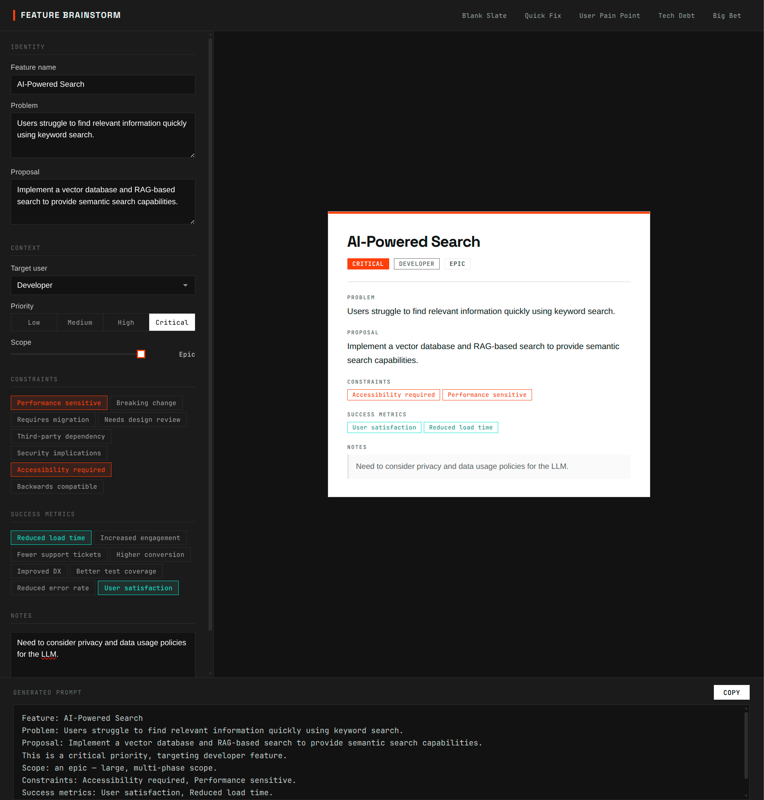

# opencode-vrida

**Vrida** - Visual rig for interactive design adjustment. Assemble-it-yourself interactive tools for [OpenCode](https://opencode.ai).

One file. Zero dependencies. No allen key required.



Vrida is a rig factory. You tell OpenCode what you need, and it assembles a single HTML file — controls on the left, a live preview on the right, and a copyable prompt at the bottom. Fiddle with knobs and sliders, watch the preview react instantly, copy the result, paste it back. Visual tinkering, assembled for your convenience.

---

## What's in the box

### Templates

Every rig starts from a template. These ship out of the box:

| Template       | What you get                                                                                                      |
| -------------- | ----------------------------------------------------------------------------------------------------------------- |
| **canvas**     | Visual design workbench — buttons, cards, layouts, spacing, color, typography. Drag sliders until it looks right. |
| **graph**      | Architecture diagrams — components, data flow, layer maps. Point, connect, annotate.                              |
| **review**     | Document review station — approve, reject, comment. Red pen sold separately.                                      |
| **brainstorm** | Structured ideation rig — constraints, metrics, feature cards. Think inside the box, then break it.               |

### Samples

Working examples live in `samples/`. Open any of them in a browser to see what rolls off the assembly line:

- `samples/canvas.html` — A design configuration rig
- `samples/graph.html` — A codebase architecture map
- `samples/review.html` — A document critique workflow
- `samples/brainstorm.html` — A feature brainstorming session

---

## Assembly instructions

### Installation

Copy or symlink the skill into your OpenCode skills directory:

```bash
# Clone the repo
git clone https://github.com/jgabor/opencode-vrida.git

# Symlink into OpenCode skills
ln -s "$(pwd)/opencode-vrida" ~/.config/opencode/skills/vrida
```

Or, if you prefer manual assembly:

```bash
mkdir -p ~/.config/opencode/skills/vrida/templates
cp opencode-vrida/SKILL.md ~/.config/opencode/skills/vrida/
cp opencode-vrida/templates/*.md ~/.config/opencode/skills/vrida/templates/
```

### Usage

Ask OpenCode to build you something:

```
> Make me a rig for button design
> Create a code map rig for my project
> Build a document review rig for this RFC
> I need a brainstorming rig for new features
```

Vrida will:

1. Pick the best-matching template (or let you choose)
2. Assemble a single-file HTML rig
3. Save it to `./vrida/<name>.html`
4. Open it in your browser (or serve it over HTTP for remote access)

---

## Features

- **One file, zero dependencies** — Everything lives in a single `.html`. Works offline. Survives the apocalypse.
- **Instant feedback** — Every control change updates the preview immediately. No "Apply" button. No waiting.
- **Smart prompts** — The output reads like a sentence a human would write, not a JSON dump.
- **Presets** — 3–5 named configurations per rig. Quick starting points so you're never staring at a blank canvas.
- **Dark theme** — Consistent, minimal design. Easy on the eyes at 2 AM.
- **HTTP server** — Optional network serving for SSH and remote access (auto-detects Python or Node).
- **Mobile-friendly** — Side-by-side on desktop, tabbed UI on small screens.

---

## Build your own template

Want a rig type that doesn't exist yet? Add a `.md` file to `templates/` and Vrida will discover it automatically.

Every template follows this blueprint:

```markdown
# Template Name

What this rig type is for.

## Controls

- Control name (type: slider/dropdown/toggle/color/text) — description, default, range

## Preview

What the live preview shows and how it responds to controls.

## Prompt rules

How to generate the natural-language prompt output.

## Presets

- **Preset Name** — description: { key: value, ... }

## Mistakes to avoid

Template-specific gotchas.
```

See the built-in templates for detailed examples — they're the instruction manuals.

---

## Contributing

Got a template that's missing from the catalog? We'd love to add it to the showroom floor.

### How to submit a new template

1. **Fork** this repo
2. **Add your template** as a `.md` file in `templates/`
   - Follow the structure shown in [Build your own template](#build-your-own-template)
   - Name it with a single, descriptive word (e.g. `dashboard.md`, `wireframe.md`)
3. **Optionally add a sample** — a working `.html` rig in `samples/` that demonstrates your template in action
4. **Open a PR** with a short description of what your template does and when someone would reach for it

### Guidelines

- **One file, one purpose.** Each template should cover a distinct rig type.
- **Write for humans.** Prompt rules should produce natural language, not data dumps.
- **Include presets.** At least 3 named presets that show the rig at its best.
- **Test it.** Make sure OpenCode can actually build a working rig from your template.

---

## License

MIT
